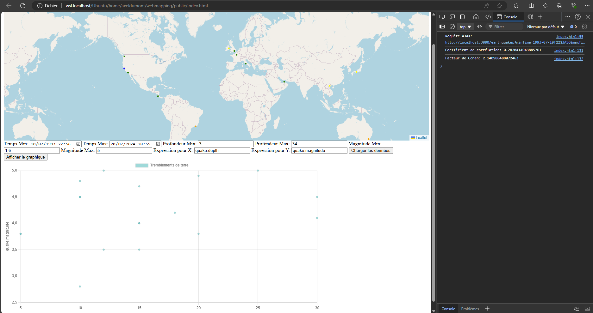

## Introduction

Ce projet permet de visualiser des tremblements de terre sur une carte interactive en utilisant Node.js, Express, PostgreSQL, PostGIS, Leaflet.js et Chart.js. Le projet comprend un serveur backend pour gérer les données et une interface frontend pour afficher les tremblements de terre sur une carte et sous forme de graphique.

## Prérequis

- Node.js et npm
- PostgreSQL avec l'extension PostGIS

## Installation

### 1. Mise à jour et installation des dépendances

Exécutez les commandes suivantes pour mettre à jour votre système et installer les dépendances nécessaires :

```bash
sudo apt update
sudo apt install nodejs npm
sudo apt install postgresql postgis
npm install cors
npm install express
```

### 2. Configuration de la base de données

Connectez-vous à PostgreSQL et configurez la base de données en exécutant les commandes suivantes :

```bash
sudo -u postgres psql
```

Dans l'interface PostgreSQL, exécutez les commandes suivantes (configurer bien le mot de passe:

```sql
ALTER USER postgres WITH PASSWORD 'postgres';
CREATE DATABASE seismic_data;
\c seismic_data
CREATE EXTENSION postgis;
CREATE TABLE earthquakes (
    id SERIAL PRIMARY KEY,
    latitude FLOAT,
    longitude FLOAT,
    depth FLOAT,
    magnitude FLOAT,
    time TIMESTAMP
);
```

```bash
\c seismic_data
```

```sql
-- Insertion de données pour les tremblements de terre
INSERT INTO earthquakes (latitude, longitude, depth, magnitude, time) VALUES
(34.05, -118.25, 10.0, 4.5, '2023-01-01 10:00:00'),
(34.10, -118.20, 12.0, 5.0, '2019-03-15 08:30:00'),
(34.08, -118.22, 8.0, 3.8, '1982-06-21 14:10:00'),
(35.68, 139.69, 30.0, 5.2, '2023-02-01 12:00:00'),
(36.00, 140.00, 25.0, 6.1, '1996-07-08 03:45:00'),
(34.70, 135.50, 20.0, 4.9, '2011-03-11 14:46:00'),
(37.77, -122.42, 5.0, 3.8, '2023-03-01 14:00:00'),
(38.00, -122.50, 7.0, 4.1, '1972-04-25 16:20:00'),
(37.80, -122.30, 6.0, 4.5, '1989-10-17 17:04:00'),
(51.51, -0.13, 15.0, 4.0, '2023-04-01 16:00:00'),
(51.55, -0.12, 10.0, 2.8, '2000-02-27 22:15:00'),
(51.50, -0.10, 8.0, 3.0, '1974-09-08 09:30:00'),
(-33.87, 151.21, 50.0, 6.1, '2023-05-01 18:00:00'),
(-34.00, 151.20, 45.0, 5.5, '1985-11-15 07:00:00'),
(-33.85, 151.25, 40.0, 4.8, '2005-01-01 02:30:00'),
(40.97, 29.08, 25.0, 7.4, '1999-08-17 03:02:00'),
(41.00, 29.10, 20.0, 6.7, '1992-03-13 17:20:00'),
(40.95, 29.05, 15.0, 5.8, '2003-11-15 11:57:00'),
(42.35, 13.40, 10.0, 6.3, '2009-04-06 03:32:00'),
(42.40, 13.45, 12.0, 5.5, '2016-08-24 06:36:00'),
(42.30, 13.35, 8.0, 4.9, '1976-05-06 21:00:00'),
(-6.21, 106.85, 35.0, 5.1, '2004-12-26 07:58:00'),
(-6.20, 106.80, 30.0, 5.9, '1968-02-09 20:47:00'),
(-6.25, 106.90, 28.0, 6.5, '1992-12-12 22:20:00'),
(-33.45, -70.65, 55.0, 7.0, '2010-02-27 06:34:00'),
(-33.40, -70.60, 50.0, 6.8, '1985-03-03 22:47:00'),
(-33.50, -70.70, 45.0, 6.1, '1971-07-08 10:45:00'),
(60.00, -150.00, 20.0, 4.3, '1990-01-15 05:10:00'),
(-45.00, 170.00, 30.0, 5.6, '2000-11-29 08:45:00'),
(10.00, -85.00, 15.0, 4.7, '2015-09-05 19:10:00'),
(19.43, -99.13, 10.0, 7.1, '2017-09-19 13:14:00'),
(28.61, 77.20, 8.0, 4.4, '1991-10-20 02:15:00'),
(33.68, 73.04, 15.0, 5.4, '2005-10-08 03:50:00'),
(13.41, 144.79, 40.0, 6.7, '1993-08-08 08:35:00'),
(35.65, -83.94, 15.0, 4.1, '1973-12-10 04:30:00'),
(55.75, 37.62, 10.0, 3.2, '1977-03-04 21:30:00'),
(39.93, 32.86, 25.0, 5.5, '1999-08-17 00:02:00'),
(-3.37, -62.35, 25.0, 4.9, '1987-11-23 18:10:00'),
(40.18, 44.51, 20.0, 5.0, '1988-12-07 11:41:00'),
(52.52, 13.40, 15.0, 4.0, '1985-08-19 10:10:00'),
(41.90, 12.50, 18.0, 4.2, '2001-07-05 16:45:00'),
(48.85, 2.35, 12.0, 3.5, '2002-04-21 09:30:00'),
(-22.90, -43.20, 30.0, 4.1, '1998-11-10 05:20:00'),
(40.71, -74.01, 8.0, 2.7, '1985-04-20 07:25:00'),
(37.98, 23.73, 15.0, 5.9, '1981-02-24 21:53:00'),
(-1.29, 36.82, 25.0, 4.8, '1974-01-13 03:20:00'),
(34.00, -6.83, 10.0, 4.0, '1980-10-10 14:40:00'),
(25.20, 55.27, 15.0, 3.5, '2007-09-12 17:45:00'),
(1.29, 103.85, 35.0, 4.5, '1994-05-21 10:00:00'),
(30.05, 31.23, 20.0, 5.0, '1992-10-12 12:23:00'),
(50.45, 30.52, 15.0, 4.1, '1986-11-30 22:55:00'),
(-37.81, 144.96, 45.0, 4.9, '2009-04-20 06:12:00'),
(59.93, 30.32, 25.0, 4.3, '1987-08-08 14:30:00'),
(53.35, -6.26, 20.0, 3.8, '2000-03-18 11:45:00'),
(-33.45, 151.21, 30.0, 5.4, '2007-08-14 18:35:00'),
(33.44, -112.07, 12.0, 3.5, '1984-06-10 04:15:00'),
(47.60, -122.33, 10.0, 4.8, '1998-06-25 01:22:00'),
(21.02, 105.83, 25.0, 5.0, '2003-05-29 09:50:00'),
(-35.28, 149.13, 30.0, 4.5, '2012-12-02 15:30:00'),
(51.48, 0.00, 8.0, 2.9, '1989-11-19 22:30:00');
```

### 3. Démarrage du serveur

Démarrez le serveur en exécutant la commande suivante :

```bash
node server.js
```

### 4. Utilisation

Pour ouvrir l’interface utilisateur il suffit d’ouvrir index.html dans un navigateur ou de le faire tourner sur un serveur.

## Fonctionnalités

### Carte Interactive

- La carte affiche les tremblements de terre sous forme de cercles colorés en fonction de la profondeur.
- Les utilisateurs peuvent filtrer les tremblements de terre par date, profondeur et magnitude via le formulaire de filtrage.

### Graphique

- Les utilisateurs peuvent créer un graphique de dispersion des tremblements de terre en spécifiant des expressions pour les axes X et Y (’quake.depth’ pour le depth ou ‘quake.magnitude’ pour la magnitude par exemple lors de la rédaction de l’expression). 
On peut retrouver par exemple l’expression suivante : 
’new Date(quake.time).getTime() - new Date().getTime()’
- Les coefficients de corrélation et les facteurs de Cohen sont calculés et affichés dans la console.

## Utilisation

1. Utilisez le formulaire pour spécifier les critères de filtrage et cliquez sur "Charger les données" pour afficher les tremblements de terre sur la carte.
2. Utilisez le formulaire pour spécifier les expressions pour les axes X et Y et cliquez sur "Afficher le graphique" pour créer un graphique de dispersion des tremblements de terre.

## Interface utilisateur

Voici un l’interface utilisateur après utilisation du filtre et du graphique : 



## Dépendances

- Node.js
- npm
- PostgreSQL
- PostGIS
- Leaflet.js
- Chart.js

## Auteurs

Ce projet a été réalisé par Axel Dumont.
